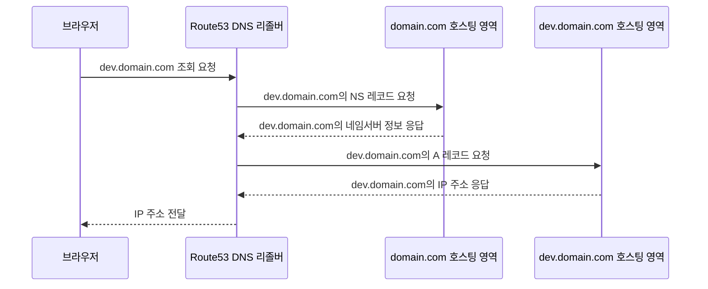

> 📌 해당 포스팅은 “[**Route 53 하위 도메인 위임**](https://southouse.tistory.com/11)” 블로그를 참고해서 진행했습니다.

### 서브 도메인 계층 구조를 도입하게 된 이유

과거 스타트업에 있을때, 개발과 운영의 서브도메인이 명확하기 분리되지 않아서 불편했던 경험이 있다.

운영, 개발, 테스트 환경의 서브도메인이 명확하게 분리하지 않는다는 것은?

예를 들어 운영 환경에서 아래와 같은 도메인 규칙이 있다고 하자

- 메인 서비스의 도메인: `domain.com`
- B2B 서비스의 도메인: `b2b.domain.com`
- 관리용 도메인: `admin.domain.com`
- API 서버 도메인: `api.domain.com`

여기에 개발 서버가 붙는다면? 

- 개발용 메인 서비스의 도메인: `dev.domain.com`
- 개발용 B2B 서비스의 도메인: `dev-b2b.domain.com`
- 개발용 관리용 도메인: `dev-admin.domain.com`
- 개발용 API 서버 도메인: `dev-api.domain.com`

위 경우는 그래도 접두사로 일관되게 dev를 붙이는 규칙을 사용해서 혼란이 적은 편이다.

여기서 QA 같은 환경이 추가로 붙게 된다면 혼란은 더 가중된다.

그리고 결정적으로 이러한 형태는 도메인 규칙은 혼란함 뿐 아니라 **트래픽을 제어하는 것도 쉽지 않았다.**

#### 어떻게 문제를 해결 할 수 있을까?

서브 도메인을 계층적으로 관리되도록 설정하는 것이다. 

호스팅 영역을 각각 만들고 최상위 도메인에 서브 도메인의 NS를 연결하는 것이다.

아래 **스크린샷은 “Route53 콘솔의의 호스팅 영역 대시보드”이다.**

운영과 개발의 호스팅 영역이 나눠있는 것을 볼 수 있다.

결과적으로 이러한 설정을 완료하면 서브도메인을 계층적으로 관리할 수 있다.

또한 계층은 다양한 전략으로 관리할 수 있다.

- 환경별로 호스팅 영역을 관리
- 서비스별로 호스팅 영역을 관리

### 1단계) 개발용 서브 도메인 호스팅 영역 생성

- dev.ddokso.com으로 호스팅 영역 생성

	

- 생성 확인

	

	

### 2단계) 생성한 개발 서브 도메인 NS를 상위 도메인에 연결

- dev.ddokso.com의 NS를 복사하여 ddokso.com에 NS 레코드로 생성한다.

	

	⇒ TTL은 완료까지는 최대한 적게 잡고 이후 2일로 늘린다.

- 확인

	

### 3단계) 생성한 개발 서브 도메인에 사용할 서브 도메인을 등록한다.

- api.dev.ddokso.com A레코드 생성 NCP로 연결

	

- 확인

	

