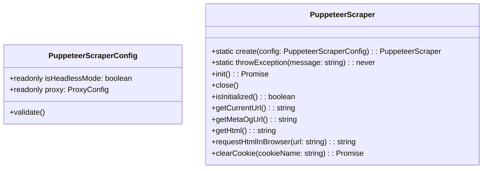
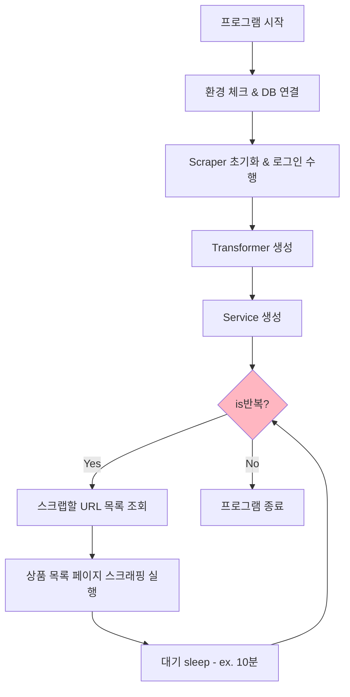
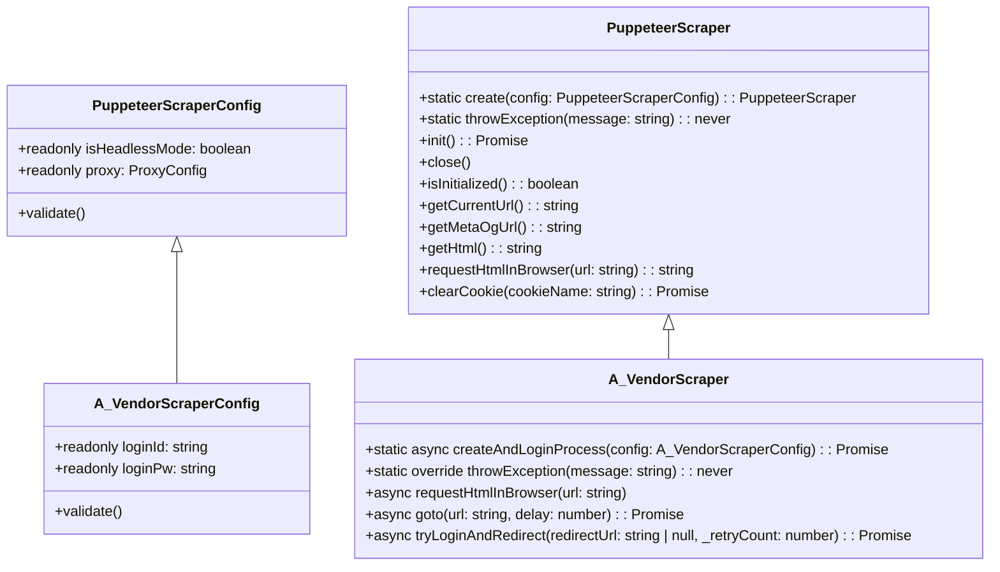

> 💡 똑소 메인 스크래퍼 서버를 보조하는 스크래퍼 CLI 프로그램 개선기에 대한 내용입니다. 지속적으로 진행중이지만, 이번에 “오늘은 써야지” 활동에서 **“이제 와서 고쳐보는 2024년의 내 코드”** 주제에 적합하다고 생각해 작성하게 되었습니다.


### 1. 코드 개선 배경


기존 CLI 프로그램은 단순하게 HTTP 요청을 통해 응답된 HTML을 파싱하는 역할만 수행했습니다.


그러다 요구사항에 의해 보조 프로그램도 로그인을 통한 동적 스크래핑이 필요하게 되었습니다. (주된 요구사항은 로그인된 가격 정보를 가져오는 것입니다.) 


기존 코드의 경우 단순한 구조를 가지고 있었습니다.



```bash
$ tree -L 2 /src

./src
│
├── lib                    # 공용 라이브러리성 공통 모듈
│   ├── cli
│   ├── client
│   ├── db                 # db관련 모듈로 drizzle를 직접 사용
│   ├── html-client.ts     # http 통신용 모듈
│   ├── util
│   ├── global-constant.ts
│   ├── global-type.ts
│   └── index.ts
│
├── repository             # orm을 사용하는 영속화 계층
│   ├── xxx.repository.ts
│   └── index.ts
│
├── service
│   ├── a-vendor-scrap.service.ts   **# 혼돈과 카오스의 서비스 계층**
│   └── index.ts
│
├── scraper.cli.ts  # 스크래퍼 CLI
└── index.ts
```



이 코드에 `puppeteer`를 사용하는 스크래퍼를 넣어야 했습니다.


먼저 `puppeteer`가 어떤 것인지 간단하게 알아보겠습니다.


### 2. puppeteer 기본 아키텍처


> 💡 puppeteer를 사용하는 주된 이유는 성능과 `CDPSession`를 사용해 크롬의 개발자 도구를 저수준 레벨로 컨트롤이 가능하기 때문입니다. 더 구체적인 정보는 포스팅 준비중에 있습니다.


Puppeteer는 Chrome DevTools Protocol을 사용하여 Chrome/Chromium을 제어하는 Node.js 라이브러리입니다.

- Node.js 메인 프로세스
- Chrome 브라우저 프로세스


#### 2.1. puppeteer 주요 컴포넌트



```text
Browser (브라우저 인스턴스)
├── CDPSession (Chrome DevTools Protocol 세션)
└── BrowserContext (브라우저 컨텍스트)
    └── Page (페이지)
        ├── Frame (프레임)
        ├── ExecutionContext (실행 컨텍스트)
        └── Worker (웹 워커)
```



**Browser**

- Puppeteer의 메인 진입점
- 브라우저 수준의 작업 관리
- 여러 개의 브라우저 컨텍스트와 페이지를 관리
- DevTools 프로토콜을 통해 Chrome과 통신

**CDPSession**

- Chrome DevTools Protocol을 직접 사용하는 저수준 인터페이스
- 브라우저의 고급 기능에 접근 가능
- 네트워크 조작, 프로파일링, 메모리 관리 등 수행
- **Browser, Page 객체를 통해 생성 및 관리**

**Browser Context**

- 브라우저 내의 격리된 환경
- 각각 독립적인 쿠키, 캐시, 저장소 상태 보유
- incognito 창과 유사한 개념

**Page**

- 브라우저의 각 탭이나 창을 대표
- DOM 조작, 이벤트 처리, 스크린샷 등 페이지 수준의 작업 수행
- 각 페이지는 독립적인 JavaScript 실행 컨텍스트 보유

즉, `puppeteer`를 사용하는 스크래퍼를 만들어야 합니다. `puppeteer`는 꽤나 자주 변경되고 복잡하다면 복잡한 편에 속합니다. 하지만 현재 서비스에 필요한 기능은 크지 않기 때문에 먼저 필요한 기능을 정의합니다.


필요한 기능 정의

1. 브라우저 엔진 사용 옵션을 주입
2. 브라우저 엔진 초기화
3. 브라우저 안전하게 종료
4. 페이지 이동
5. 현재 페이지 HTML 가져오기
6. 개발자 모드 핸들러 - 쿠키, 세션 등 핸들링
7. 개발자 모드에서 HTML 요청

결과적으로 아래와 같은 클래스 다이어그램이 나왔습니다.





### 2. 구현된 PuppeteerScraper를 적용한 개선된 코드


> 💡 interface를 통한 추상화는 설명에 복잡성을 낮추기 위해 생략했습니다.


#### 2.1. 소스코드 폴더 구조 간략 설명



```bash
$ tree -L 2 /src

./src
├── **a_vendor**                # 스크래핑 대상 밴더별로 생성하는 core 모듈
│   ├── index.ts
│   ├── parser
│   ├── scraper            # lib/puppeteer를 상속 스크래퍼
│   ├── transformer
│   └── util
│
├── lib                    # 공용 라이브러리성 공통 모듈
│   ├── cli
│   ├── client
│   ├── db                 # db관련 모듈로 drizzle를 직접 사용
│   ├── **puppeteer          #** PuppeteerScraper, PuppeteerScraperConfig
│   ├── util
│   ├── global-constant.ts
│   ├── global-type.ts
│   └── index.ts
│
├── repository             # orm을 사용하는 영속화 계층
│   ├── xxx.repository.ts
│   └── index.ts
│
├── service
│   ├── a-vendor-scrap.service.ts
│   └── index.ts
│
├── scraper.cli.ts  # 스크래퍼 CLI
└── index.ts
```



소스코드의 핵심 전략은 단방향 의존입니다.

- `a_vendor` 모듈은 → `lib` 모듈을 의존한다.
- `lib` 모듈은 외부에 의존성을 가지지 않으며, 동립적으로 실행이 가능 해야한다.(외부 import가 없다)
- 특히 `lib/`**`puppeteer`**는 이후 독립된 npm 라이브러리화를 통해 프로젝트에서 공통으로 사용하게 할 계획에 있습니다.


#### 2.2. CLI 의존성


CLI는 Service를 직접 의존합니다. 


또한 REST API로 변경될 것을 염두해서 익숙한 레이어드 아키텍처로 설계를 했습니다.


#### 2.3. Service 의존성


- `Scraper`의 경우 아직 여러 고민 있지만 현재는 1개의 브라우저 엔진을 사용하는 방향으로 설계 했습니다.
- 때문에 `Scraper`는 서비스에서 바로 사용할 수 있는 적합한 형태인 초기화와 로그인된 페이지 랜더링 상태로 주입되어야 합니다.


#### 2.4. `scraper.cli.ts` 플로우 차트 - 상품 리스트 페이지





**사용 예시**



```typescript
 await ProgramRunner.create()
    .printEnv()
    .checkingEnv()
    .approval(async () => {
      await runDb(async (db) => {
        console.log('scraping start - ', new Date().toISOString());

        // 1. 스크래퍼를 초기화 하고 로그인 수행
        const a_vendorScraper = await A_VendorScraper.createAndLoginProcess(
          new A_VendorScraperConfig(),
        );
        // 2. html 변환기 생성
        const transformer = new A_VendorTransformer(
          new A_VendorHtmlParserProvider(),
        );
        // 3. 서비스 생성
        const service = new A_VendorScrapService(
          a_vendorScraper,
          transformer,
          db,
        );

        while (remainingCount > 0) {
          // 1. 스크래핑 대상 URL 조회
          const targetUrls =
            await service.getScrapProductListPageUrls();
          // 2. 스크래핑 실행
          await service.runScrapProductListPage(targetUrls);
          await ScraperUtil.sleep(INTERVAL);
        }
      });
    });
```



#### 2.5. `PuppeteerScraper` 클래스 다이어 그램


> 📌 상속 구조를 만들게 된 주된 이유는 `Puppeteer`를 사용하기 위한 코드와 벤더별 웹 페이지를 컨트롤 하는데 필요한 코드가 하나의 클래스에 혼재되어 복잡성이 높았고, 이를 해결하기 위한 방법으로 상속구조를 사용했습니다.





- `PuppeteerScraperConfig`
	- `PuppeteerScraper`를 생성하고 사용하기 위해 필요한 옵션의 관리를 책임진다.
- `A_VendorScraperConfig`
	- `A_VendorScraper`를 생성하고 사용하기 위해 필요한 옵션의 관리를 책임진다.
	- `PuppeteerScraper`를 상속한다.
- `PuppeteerScraper`
	- `Puppeteer`를 사용하기 위한 core 메서드와 전략을 책임진다.
	- `Puppeteer`를 직접 사용하는 스크래퍼 객체
- `A_VendorScraper`
	- `PuppeteerScraper`를 상속한다.
	- A 벤더를 스크래핑 하는데 필요한 core 로직을 관리하는 책임을 가진다.
		- ex) A 벤더 login 페이지 접근 로그인 수행


#### 2.6. `xxxParserProvider` 클래스


> 📌 - 특정 HTML 페이지 마다 계속 생성될 예정인 parser 클래스를 한 곳에서 관리하고 공급하는 책임을 가진다.

	- 특정 HTML 페이지 마다 계속 생성될 예정인 parser 클래스를 한 곳에서 관리하고 공급하는 책임을 가진다.



```typescript
/** A 벤더 page html 파서를 공급하는 객체 */
export class A_VendorHtmlParserProvider {
  /**
   * 상품 리스트 페이지 파서
   * @param html
   * @returns
   */
  getProductListParser(html: string): A_VendorProductListHtmlParser {
    return A_VendorProductListHtmlParser.parse(html);
  }

  /**
   * 상세 페이지 파서
   * @param html
   * @returns
   */
  getProductDetailParser(html: string): A_VendorProductDetailHtmlParser {
    return A_VendorProductDetailHtmlParser.parse(html);
  }

	// ... 생략
}
```



**사용 예시 -** **`A_VendorTransformer`**



```typescript
export class A_VendorTransformer {
  constructor(private readonly parserProvider: A_VendorHtmlParserProvider) {}
  
  /**
   * 리스트 페이지에서 스크래핑된 데이터를 DB나 로직에 사용하기 적합한 형태로 가공
   */
  transformByProductListPage(html: string): A_VenderProductListPage[] {
    const parser = this.parserProvider.getProductListParser(html);
    // ... 생략
  }
  
  /**
   * 상세 페이지에서 스크래핑된 데이터를 DB나 로직에 사용하기 적합한 형태로 가공
   */
  transformByDetailPage(
    vendorId: number,
    html: string,
  ): A_VenderDetailPage {
    const vendorParser = this.parserProvider.getVendorDetailParser(html);
    // ... 생략
  } 
}
```



