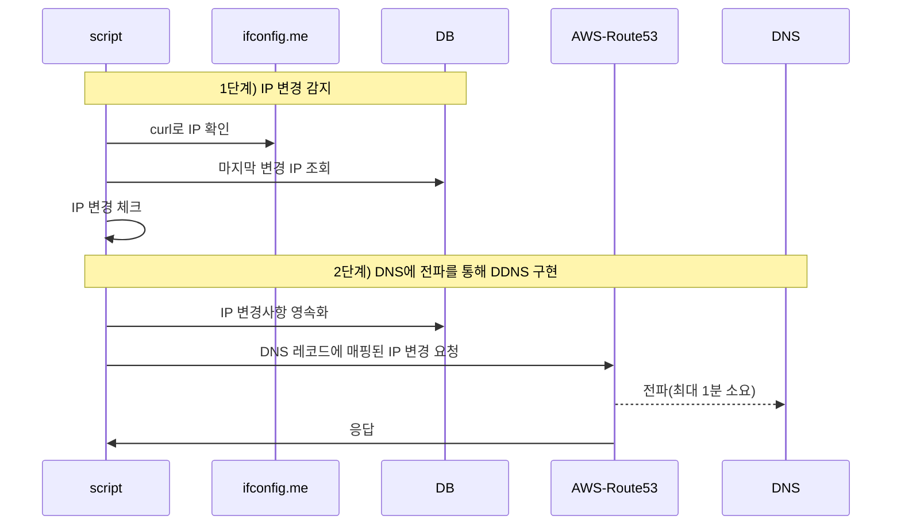
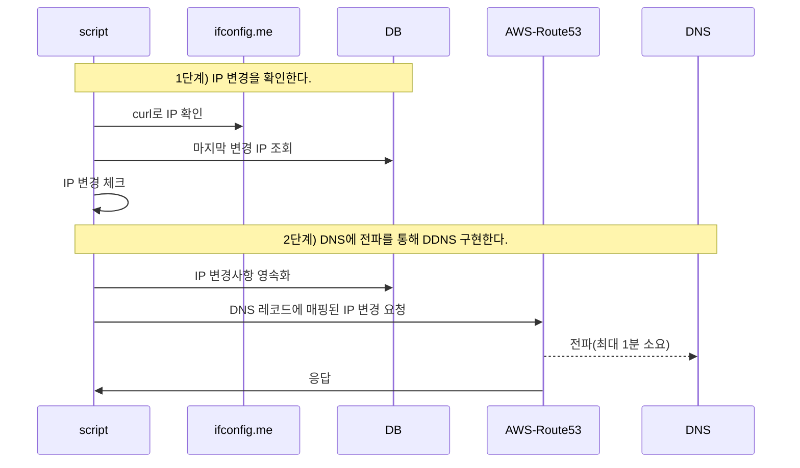

> 📌 해당 글에서는 가용 가능한 자원안에서 DDNS를 간단하게 구축한 사례를 소개합니다.  
> (공유기 DDNS를 사용하지 못하는 상황을 전제로 작성되었습니다.)


**👀 결과 미리보기**





### 1. 배경 설명


똑소는 비용 절감을 목적으로 Local Network 환경을 적극 활용하고 있습니다.


Local Network 특성상 IP가 변경되는 경우가 발생합니다. 그리고 IP가 변경되면 Local Network 있는 Server를 바라보는 서비스는 모두 장애가 발생하게 됩니다.


> 💡 잠깐!! 공유기에서 무료로 DDNS 기능을 제공하는데 왜 따로 만들었나요?


외부 인터넷과 Home Network를 연결해본 경험이 있으신 분들은 이상한 점을 느끼셨을 겁니다.


우리가 흔하게 사용하는 공유기는 Network 장비 종합선물 세트입니다. 때문에 통신사 공유기, iptime, 티피링크 같은 공유기를 사용하는 사용자는 모두 각 벤더들이 운영하는 DDNS를 사용할 수 있습니다. (공유기 DDNS 설정에 관해 궁금하다면 [해당 포스트](https://dbwogus94.github.io/posts/%ED%94%84%EB%A1%9C%EC%A0%9D%ED%8A%B8-BMW-3.-%EC%9D%B8%ED%94%84%EB%9D%BC1-On-premise-%EC%84%9C%EB%B2%84-%EC%84%B8%ED%8C%85/#3-iptime%EA%B3%B5%EC%9C%A0%EA%B8%B0%EB%A5%BC-%EC%82%AC%EC%9A%A9%ED%95%9C-%EC%99%B8%EB%B6%80-%EC%A0%91%EC%86%8D-%EC%84%A4%EC%A0%95-with-ddns)를 참고해주세요.)


벤더에서 운영하는 DDNS를 사용하면 편하지만 내부적인 사정과 이후 유연하게 사용하지 못하는 단점등의 이유로 공유기 벤더의 DDNS를 사용하지 않고 직접 만들기로 했습니다.


### 2. 문제 해결을 위해 고려된 후보군


처음부터 DDNS를 생각한 것은 아니였습니다. 


주된 요구사항은 “IP 변경시 장애가 발생하지 않고 접근 가능해야 한다.” 였고


이를 해결하기 위해 다양한 후보군이 있었습니다.

1. SSH 프록시 터미널
2. DB를 통해 변경된 IP를 의존한다.
3. DDNS를 사용한다.
4. …


#### 2.1. “DDNS” + “변경된 IP를 DB 저장한다.”


그리고 이 중 두가지 방법을 혼합해서 사용하기로 합니다.

1. **DDNS**: 메인은 DDNS를 사용해서 관리합니다.
2. **DB**: DB에 변경된 IP 정보를 저장한다.

> 💡 왜 두가지 방법을 혼합했을까?


DDNS에 변경이 밀리는 경우에 DB에 저장된 IP를 사용해 통신할 수 있기 때문입니다. 


이러한 방지책을 마련한 이유는 “Route53에 Record 변경은 최대 1분이 걸릴 수 있다”고 안내되어 있기 때문입니다. ( 테스트에서 IP 변경은 1초 내로 이루어졌습니다. )


### 3. DDNS 구축하기


#### 3.1. Table DDL 정의



```sql
CREATE TABLE `admin_ip_history` (
  `id` bigint NOT NULL AUTO_INCREMENT COMMENT 'ID',
  `createdAt` datetime NOT NULL DEFAULT CURRENT_TIMESTAMP COMMENT '생성일',
  `updatedAt` datetime NOT NULL DEFAULT CURRENT_TIMESTAMP ON UPDATE CURRENT_TIMESTAMP COMMENT '수정일',
  `ip` varchar(255) NOT NULL COMMENT 'ip address',
  `name` varchar(255) NOT NULL COMMENT '명칭',
  `version` int NOT NULL DEFAULT '1' COMMENT '버전 번호',
  `originId` bigint NOT NULL DEFAULT '0' COMMENT '초기 원본 IP PK',
  `note` text COMMENT '노트',
  PRIMARY KEY (`id`)
) ENGINE=InnoDB AUTO_INCREMENT=1 DEFAULT CHARSET=utf8mb4 COLLATE=utf8mb4_0900_ai_ci;
```



**✅ 데이터 예시**


`version`과 `originId`를 사용해 IP가 변경을 추적합니다.


| id | createdAt    | updatedAt    | ip              | name         | version | originId | note         |
| -- | ------------ | ------------ | --------------- | ------------ | ------- | -------- | ------------ |
| 1  | yyyy-MM-dd … | yyyy-MM-dd … | 111.111.111.111 | ddokso-scrap | 1       | 1        | 초기 IP INSERT |
| 2  | yyyy-MM-dd … | yyyy-MM-dd … | 222.222.222.222 | ddokso-scrap | 2       | 1        | 변경 IP INSERT |
| 3  | yyyy-MM-dd … | yyyy-MM-dd … | 333.333.333.333 | ddokso-scrap | 3       | 1        | 변경 IP INSERT |

undefined
**✅ 활용 예시**


원본 IP를 사용해서 마지막 변경된 IP를 조회합니다.



```sql
SELECT h1.*
FROM admin_ip_history h1
JOIN (
  SELECT originId, MAX(version) as max_version
  FROM admin_ip_history
  WHERE originId = 1 -- 초기 원본 IP PK
  GROUP BY originId
) h2 ON h1.originId = h2.originId AND h1.version = h2.max_version
```



#### 3.2. AWS SDK 사용 준비

1. AWS IAM에서 Route53 전용 권한 생성
2. 생성된 권한에서 Access Token을 생성한다.


#### 3.3. 스크립트 로직 설계





**1단계) IP 변경 확인**

1. `curl -s ifconfig.me` 를 통해 현재 사용중인 IP를 찾습니다.
2. DB에 저장된 마지막 IP와 비교합니다.
3. 두 값이 다르다면 변경 로직을 실행합니다.

**2단계) IP 변경 수행**

1. `admin_ip_history`에 신규 버전으로 Insert를 수행합니다.
2. AWS SDK를 사용해서 Route53의 A Record에 매핑된 IP 수정을 요청합니다.


### **4. 구현된 스크립트 예시**



```typescript
/**
 * IP 변경을 추적하고 코드로 DDNS 구현하는 스크립트
 * - 시작전 환경변수를 검증한다.
 * - DB 커넥션을 얻어온다.
 *    1. DB에서 IP를 조회하고 현재 외부 IP랑 비교한다.
 *    2. IP가 다르다면 최신 IP를 DB에 Insert 한다.
 *    3. AWS Route53 레코드에 신규 IP를 매핑시킨다.
 */
export const main = async (config: MainConfig) => {
  const configManager = new ConfigManager(config);
  // 환경변수 검증
  configManager.validate();
  // DB 연결
  return await runDB(configManager.connectionConfig, async (connection) => {
    /** Local Iptime 초기 원본 레코드 ID */
    const IP_HISTORY_ORIGIN_ID = 1;
    const repository = new AdminIpHistoryRepository(connection);
    const routerRecordManager = new Route53RecordManager(
      configManager.route53RecordManagerConfig,
    );

    // originId가 1인 최신 버전 레코드 가져오기
    const latestRecord =
      await repository.findOneLatestVersionByOriginId(IP_HISTORY_ORIGIN_ID);

    if (!latestRecord) {
      throw new Error(
        `❌ originId가 ${IP_HISTORY_ORIGIN_ID}인 레코드가 없습니다. 초기 데이터 생성이 필요합니다.`,
      );
    }

    // 현재 IP 가져오기
    const currentIp = await getIp();
    if (latestRecord.ip === currentIp) {
      console.log('\n🟡 IP가 변경되지 않았습니다.');
      return;
    }

    console.group('\n🟢 IP가 변경되어 스크립트를 진행합니다.');
    // step 1) IP 비교 후 다르면 새 버전 삽입
    await runStep1_InsertNewIp(repository)(currentIp, latestRecord);

    // step 2) Route53 레코드 업데이트 수행
    await runStep2_UpdateRoute53Record(routerRecordManager)(
      configManager.recordIdentity, // Route53 레코드 식별값
      currentIp,
    );
    console.groupEnd();
  });
};

/**
 * curl을 사용해 외부 IP 주소를 가져옵니다.
 * - 사용된 명령: `curl -s ifconfig.me`
 * @returns 외부 IPv4 주소
 */
async function getIp(retryCount = 3) {
  try {
    const { stdout } = await execAsync('curl -s ifconfig.me');
    return stdout.trim();
  } catch (error) {
    if (retryCount > 0) return await getIp(retryCount - 1);

    // Note: ChildProcess를 통해 요청, 에러 stack에 잡히지 않아 신규 Error를 생성
    console.error(error);
    throw new Error('IP 주소를 가져오는데 실패했습니다.');
  }
};

/**
 * DB에 새 버전 Insert를 수행합니다.
 * - 커링 함수 리턴
 * @param repository
 * @returns
 */
function runStep1_InsertNewIp(repository: AdminIpHistoryRepository) {
  return async (currentIp: string, latestRecord: AdminIpHistory) => {
    console.log('Step 1) DB에 신규 IP를 변경사항 반영을 시작합니다.');
    await repository.insertNewIp(currentIp, latestRecord);
  };
}
/**
 * Route53 레코드 업데이트 수행
 * - 커링 함수 리턴
 * @param recordManager
 * @returns
 */
function runStep2_UpdateRoute53Record(recordManager: Route53RecordManager) {
  return async (recordIdentity: Route53RecordIdentity, newIp: string) => {
    console.log('\nStep 2) Route53 레코드에 신규 IP 업데이트 시작합니다.');
    await recordManager.upsertSubdomainARecord(recordIdentity, newIp);
    await setTimeout(3000);
    
    const aRecord = await recordManager.findRecord(recordIdentity);
    if (aRecord?.ResourceRecords?.[0]?.Value !== newIp) {
	    // 3초 뒤 변경이 되지 않았다면 실패라고 가정한다.
      throw new Error('❌ Route53 레코드 업데이트 실패');
    }
  };
}
```



### 5. 결론


DDNS를 사용의 가장 큰 장점은 IP를 직접 의존하지 않는다는 것입니다.


결과적으로 API에서 내부 HTTP 요청, 원격에서 shell 접근도 언제든 DDNS를 통해 가능하게 됩니다.

