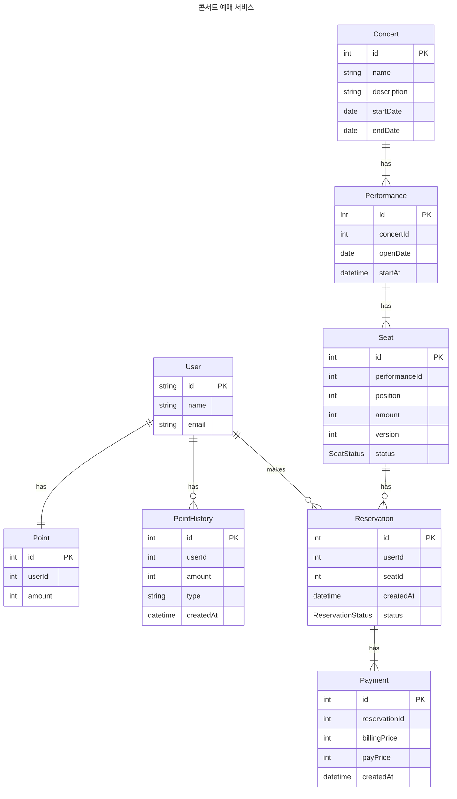

### Overview


지난 챕터에서 조회 성능을 향상하기 위해 캐시를 사용했습니다. 캐시를 통해 조회 성능을 개선 했지만 거기에는 결국 캐시는 은탄환이 되지 못 한다고 생각합니다. 


캐시는 데이터의 신선도를 포기하고 성능을 얻는 기술입니다. 캐시를 사용하면서 신선도를 최대한 가져오려면 캐시 갱신 주기를 최대한 짧게 가져가는 것이 중요합니다. 


💡 캐시 갱신 주기를 단순하게 짧게 가져가면 문제가 해결될까요?


단순하게 판단 할 수 없습니다. 짧은 캐시 갱신 주기는 그 만큼 더 많은 DB 접근을 의미합니다. 더 큰 문제는 캐시 갱신 주기가 DB 조회 속도 보다 빠른 경우입니다. DB 조회 속도보다 빠르게 캐시 갱신이 발생한다는 것은 커넥션이 밀리게 된다는 의미와 같습니다. 이렇게 되면 서비스의 장애로 이어지기 딱 좋습니다.


💡 어떻게 해야할까요? 


이러한 이유로 RDMS에서는 인덱스 설정이 매우 중요합니다. 이번 보고서에서는 인덱스가 왜 중요한지 그리고 인덱스를 어떻게 활용해야 하는지 정리합니다.


### 1. 인덱스란 


인덱스를 우리말로 하면 “색인” 또는 “목차” 라는 단어입니다.


> **색인**(索引)은 책 속의 낱말이나 구절, 또 이에 관련한 지시자를 찾아보기 쉽도록 일정한 순서로 나열한 목록을 가리킨다. **인덱스**(index)라고도 한다.  
> - [위키백과](https://ko.wikipedia.org/wiki/%EC%83%89%EC%9D%B8)


> **목차**(目次)는 책이나 서류 따위에서 항목 제목과 해당 쪽 번호를 차례대로 적은 목록으로, 그 내용을 간략하게 알거나, 쉽게 찾아 볼 수 있게 한 것이다.  
> - [위키백과](https://ko.wikipedia.org/wiki/%EB%AA%A9%EC%B0%A8)


위의 사전적 단어를 정리하면 **“내용을 간략하게 찾아보기 쉽도록 나열한 목록”로** 볼 수 있습니다.


#### RDBMS에서 Index란 무엇일까요


> **인덱스**(영어: index)는 데이터베이스 분야에 있어서 테이블에 대한 동작의 속도를 높여주는 자료 구조를 일컫는다. 인덱스는 테이블 내의 1개의 컬럼, 혹은 여러 개의 컬럼을 이용하여 생성될 수 있다. 고속의 검색 동작뿐만 아니라 **레코드 접근과 관련 효율적인 순서 매김 동작에 대한 기초**를 제공한다  
> - [위키백과](https://ko.wikipedia.org/wiki/%EC%9D%B8%EB%8D%B1%EC%8A%A4_(%EB%8D%B0%EC%9D%B4%ED%84%B0%EB%B2%A0%EC%9D%B4%EC%8A%A4))


사전적 의미는 조금 어렵지만 **“데이터베이스에 저장된 자료의 효율적인 접근을 도와주는 자료구조”**라고 이해할 수 있겠습니다.


인덱스를 단순화한 이미지를 보겠습니다.


이미지를 보면 인덱스를 관리하는 Table이 존재하며, 원본이 어디에 있는지 알려주고 있습니다.


이해를 위해 서점의 도서 검색 시스템을 예시로 들어보겠습니다.


서점에 가면 책이 있는 위치를 찾기 위해 도서 검색 시스템에 도서의 이름을 작성합니다. 그러면 검색 시스템에서는 아래 이미지 처럼 책이 존재하는 서고 위치를 알려 줍니다. 만약 서점의 모든 서고를 하나 하나 찾는다고 상상해 보면 어떨까요. 가능하겠지만 굉장히 많은 시간이 걸리게 될것입니다.


데이터 베이스의 인덱스도 마찬가지 입니다. 많은 데이터를 관리하는 데이터베이스에 인덱스가 없다면 RDBMS는 데이터를 순차적으로 찾게되고 조회 성능은 처참하게 될것입니다.


### 2. Mysql의 인덱스 간략하게 정리


인덱스에 대한 학습이 주제가 아니기 때문에 간략하게 정리하고 넘어가겠습니다.


#### 인덱스의 자료구조


Mysql 8.0 기준 **B+Tree, Hash, Bitmap, R-Tree, Full-Text 등**  여러가지 자료구조를 제공합니다.


이중 가장 보편적(거의 대부분)으로 사용되는 B+Tree을 알아보겠습니다.


B+Tree는 B-Tree의 확장된 형태의 자료구조입니다. B-Tree에서 추가적인 개선을 시킨 자료구조라는 의미로 '+'가 붙었다고 합니다.

- 모든 데이터는 오직 리프 노드에만 저장됩니다
- 중간 노드들은 key만 보유하고 실제 데이터(value)는 저장하지 않습니다.
- 리프 노드들은 연결 리스트(Linked list)로 서로 연결되어 있습니다.

위와 같은 특징이 있지만 가장 크게 개선되었다고 생각되는 점은 범위 검색에 대한 개선점 입니다.



```sql
SELECT * FROM a_table
WHERE from_date BETWEEN '2024-01-01' AND '2024-12-31'
```



- **B-Tree 한계**: 범위 검색에서 각 데이터마다 트리의 루트부터 리프까지 반복적으로 탐색해야 하는 비효율적인 구조를 가집니다.
- **B+Tree 개선점:** 리프 노드들이 연결 리스트로 연결되어 있어 한 번의 트리 탐색 후 순차적으로 데이터를 읽을 수 있는 장점을 가집니다.


#### mysql의 인덱스 버전에 따른 큰 변화


mysql은 5.7 버전 다음 8.0 버전을 가집니다. 버전의 크게 증가한 만큼 큰 변화가 있었으며 인덱스 또한 많은 발전이 이뤄졌다고 합니다.

1. 내림차순에 정렬시 인덱스 지원과 복합 인덱스에서 각 컬럼별 정렬 방향 지정 가능
2. 인덱스 통계정보를 메모리 저장에서 디스크 영구 저장으로 변경
3. 인덱스를 삭제하지 않고 일시적으로 사용 중지 가능(**Invisible Index)**
4. 가상 컬럼을 통한 함수형 인덱스 지원

> 📌 인덱스는 읽기 성능만 올리는 기술은 아니다.  
> Mysql 기준 인덱스는 락을 잡는데 깊은 영향을 끼치며 성능에 영향을 준다.   
> 레코드에 락을 걸게 되면?   
>   
> 1. DBMS는 먼저 인덱스를 탐색하고, index에 걸리는 모든 row에 락을 걸게 된다.  
>   
> 2. 인덱스가 없다면, Full-Scan으로 락 대상이 될 레코드를 찾는다.


	Mysql 기준 인덱스는 락을 잡는데 깊은 영향을 끼치며 성능에 영향을 준다. 
	레코드에 락을 걸게 되면? 

	1. DBMS는 먼저 인덱스를 탐색하고, index에 걸리는 모든 row에 락을 걸게 된다.
	2. 인덱스가 없다면, Full-Scan으로 락 대상이 될 레코드를 찾는다.


### 3. 효과적인 인덱스 적용 방법


먼저 인덱스 적용에는 정량적인 정답이 존재하지 않으며, 고정적인 값이 아니라고 생각합니다.


인덱스는 현재 데이터에 효과적으로 접근하는 방법이기 때문입니다. 


데이터는 서비스가 살아있는한 계속 변경되고 이러한 이유로 인덱스의 적용은 현상에 대한 대처가 되어야 하지, 방지책으로 생각하는 것도 위험하다고 생각합니다.


조사 결과 3가지 정도의 관점으로 정리할 수 있었습니다.

1. 쿼리 실행 계획과 통계정보 활용
2. 카디널리티 기반 분석
3. 비즈니스 관점의 분석

아직 명확한 데이터가 없기 때문에 여기서는 1을 기반으로 설명합니다.


#### 쿼리 실행 계획과 통계정보 활용


**`EXPLAIN`** **명령어를 사용해 실행 계획 분석**

1. **type 정보:** 조회 방식에 대한 정보를 제공한다.
2. 실제 사용될 인덱스 정보를 제공한다.
3. `EXPLAIN`을 통한 실행 계획은 실제 실행에 대한 계획이 아닌 통계정보를 통한 예측이다.
4. 실제 실행시 사용된 계획을 보려면 `EXPLAIN ANALYZE` 명령을 사용한다.
undefined
**`innodb_index_stats`****를 사용해서 인덱스에 대한 통계정보를 얻을 수 있다.**

1. **카디널리티 정보:** `n_diff_pfx01` 등으로 유니크한 값의 개수를 판단한다.
2. **페이지 정보**: `size`나 `n_leaf_pages`를 통해 인덱스의 페이지 수를 판단한다.

**`innodb_table_stats`****를 사용해 테이블의 통계적인 정보를 얻을 수 있다.**

	- **`n_rows`**: 테이블의 예상 행 수
	- **`clustered_index_size`**: 클러스터드 인덱스(주 인덱스)의 크기로 중복도와 관련된다.

**통계정보는 참고 사항이며, 항상 일치한다는 보장은 없다.**


- 주의할 점은 `last_update`의 시간이다. 수집되는 데이터는 실시간이 아닌 특정 조건에 따라 수집되기 때문에 실제와 오차가 존재한다.

> 📌 통계 데이터 갱신 TIP  
> - 즉시 갱신: `ANALYZE TABLE reservation;`  
>   
> - 갱신 주기 변경  
>   
> - 주로 불일치가 발생하는 지점

	- 즉시 갱신: `ANALYZE TABLE reservation;`
	- 갱신 주기 변경
		- `innodb_stats_auto_recalc=1` 으로 설정하면 테이블의 데이터 10% 이상 변경시 갱신
	- 주로 불일치가 발생하는 지점
		- INSERT, UPDATE, DELETE 대량의 데이터 변경
		- 트랜잭션 진행중, InnoDB의 경우 MVCC를 사용하기 때문에 격리수준에 따라 차이 발생


### 4. 공연 예매 서비스 인덱스 설계 (예측)


#### 주요 테이블 분석





**콘서트 관점에서 예상되는 데이터**


콘서트 예약 서비스의 데이터 구조는 어떤 예약 서비스를 만드는 지에 따라 크게 달라질 수 있다고 생각됩니다.


💡 인터파크 티켓 처럼 대형 공연을 위주로 예약하는 서비스라면?

	- 분류: 콘서트 → 공연 → 좌석
	- 특징: 소분류인 좌석이 수백 ~ 수만개 까지 다양하다.

💡 디트릭스 처럼 소규모의 독립영화 예매하는 사이트라면?

	- 영화 > 일자 > 좌석
	- 특징: 대 중 소 분류 모두 소규모이다

💡콘서트의 범주는 아니지만 예약 시스템 개념을 가진 케치테이블 이라면?

	- 분류: 식당 → 일자 → 좌석
	- 특징: 대분류인 식당 자체가 매우 많으며 다양한 조건의 필터링이 존재한다.

**예약과 결제 관점에서 예상되는 데이터**


예약 데이터는 초기에는 적겠지만 서비스가 생존하는 기간동안 지속적으로 증가하게 되는 데이터 입니다.


또한 아직은 없는 요구 사항이지만 통계적인 데이터를 위해 조회될 여지가 많은 데이터라고 생각됩니다.

- 특정 기간에 가장 많이 예약(결제)된 콘서트
- 콘서트마다 가장 인기 있는 좌석, 가장 인기 있는 공연 기간
- 콘서트와 좌석의 평균 가격

**핵심 조회 패턴**

1. 좌석 예약을 위한 예약 가능한 좌석 조회
2. 결제를 위한 예약 조회


#### 인덱스 적용 계획


**테이블별 인덱스 설계안**

1. FK가 있어야 하는 컬럼에는 모두 인덱스 적용
2. 좌석, 예약 테이블 상태 컬럼에 인덱스 적용
	1. 예약가능한 상태의 좌석 조회
	2. 임시예약 상태의 예약 결제
3. 락의 경우 PK를 사용하기 때문에 적용 대상 제외

**예상되는 성능 개선 효과**


콘서트의 경우 요구사항을 만족하는 조건이 대부분 기본적으로 적용되는 인덱스로 커버가 가능합니다.


특히 **“예약 가능한 좌석 리스트 조회”**의 경우 부모인 공연ID와 상태를 복합 인덱스로 묶기 때문에 더 효과적일 것이라고 예상되기 때문에 해당 케이스로 테스트를 진행하려 합니다.


### 5.  실제 성능 분석으로 인덱스 성능 파악


#### **테스트 환경 셋팅**


**서버 사양**

- API 서버 - Mac M2 Air
	- Nodejs 단일 인스턴스
	- 커넥션 풀 30개
- DB 서버 - CPU(i5-5200U), RAM(8GB), SSD(128GB)
	- Mysql 8.0 도커 이미지로 실행

**데이터 세트 구성**

- 콘서트:
	- 콘서트 데이터 총 10개
	- 공연은 각 콘서트 마다 500개, 총 5000개
	- 좌석은 공연마다 약 1000개, 총 500만개

**테스트 시나리오:** ✅ **좌석 조회 리스트 1000번 조회**

- k6를 사용 - API 서버와 동일한 머신에서 사용



```typescript
reservation_process: {
  executor: 'shared-iterations', // 정확한 반복 횟수를 보장
  vus: 100, // 동시 사용자 수
  iterations: 1000, // 총 요청 수
  maxDuration: '600s', // 최대 실행 시간
},
```



#### 1. 인덱스 적용 전


**실행 계획**


- type: `index`
- 후보키: null
- 실제 사용키: `PK`
- 대상: `4,707,995`(5000000 실측 레코드)로 테이블 전체 레코드가 대상이되었다.

**부하 테스트**


- 총 시간: 8분 12.7초
- `avg=43s      min=1s     med=2.4s    max=3m33s  p(90)=2m35s   p(95)=3m17s`
- `min`과 `max`의 데이터가 극명하게 나뉘는 가장 큰 이유는 커넥션이 밀리기 시작하면서로 관측되었다.


#### 2. FK에 인덱스 적용 


**적용된 Index**



```sql
CREATE INDEX idx_seat_performanceId ON seat (performanceId);
```



**실행 계획**


- type: `ref`
- 후보키: `idx_seat_performanceId`
- 실제 사용키: `idx_seat_performanceId_status`
- 키 사이즈: `4`
- 대상: `1,030`

**부하 테스트 결과**


- 총 시간: 21.9 초
- `avg=2.01s    min=1.01s  med=2.02s   max=3.34s    p(90)=2.81s   p(95)=2.91s`


#### 3. FK와 복합 인덱스 적용


**적용된 Index**



```sql
CREATE INDEX idx_seat_performanceId ON seat (performanceId);
CREATE INDEX idx_seat_performanceId_status ON seat (performanceId, status);
```



**실행 계획**


- type: `ref`
- 후보키: `idx_seat_performanceId_status`,`idx_seat_performanceId`
- 실제 사용키: `idx_seat_performanceId_status`
- 키사이즈: `1026`
- 대상: `349`

**부하테스트**


- 총 시간: 22.2 초
- `avg=2.04s    min=1s     med=2.07s  max=3.23s    p(90)=2.84s   p(95)=2.93s`


### 6. 테스트 결과 정리


| 구분            | 인덱스 적용 전     | FK 인덱스 적용                       | FK + 복합 인덱스 적용                                            |
| ------------- | ------------ | ------------------------------- | --------------------------------------------------------- |
| **실행 계획**     |              |                                 |                                                           |
| type          | index        | ref                             | ref                                                       |
| 후보키           | null         | `idx_seat_performanceId`        | `idx_seat_performanceId_status`, `idx_seat_performanceId` |
| 실제 사용키        | PK           | `idx_seat_performanceId_status` | `idx_seat_performanceId_status`                           |
| 키 사이즈         | 4            | 4                               | 1026                                                      |
| 대상 레코드 수      | 4,707,995    | 1,030                           | 349                                                       |
| **부하 테스트 결과** |              |                                 |                                                           |
| 총 실행 시간       | **8분 12.7초** | **21.9초**                       | **22.2초**                                                 |
| 평균 응답시간       | 43초          | 2.01초                           | 2.04초                                                     |
| 최소 응답시간       | 1초           | 1.01초                           | 1초                                                        |
| 중간값           | 2.4초         | 2.02초                           | 2.07초                                                     |
| 최대 응답시간       | 3분 33초       | 3.34초                           | 3.23초                                                     |
| 90퍼센타일        | 2분 35초       | 2.81초                           | 2.84초                                                     |
| 95퍼센타일        | 3분 17초       | 2.91초                           | 2.93초                                                     |

undefined
주요 개선사항:

1. 대상 레코드 수가 470만건 → 1,030건 → 349건으로 대폭 감소
2. 총 실행 시간이 8분에서 22초대로 크게 개선
3. 평균 응답시간이 43초에서 2초대로 감소
4. 최대 응답시간이 3분 33초에서 3초대로 안정화


### 7. 결론과 배운점


먼저 FK 자체를 사용하지 않고 서비스를 개발한 경험이 없어 이렇게 극적인 차이가 발생할 것이라고는 전혀 예상하지 못했습니다. 구형 하드웨어 DB를 띄운것도 영향이 없지는 않았겠지만 8분과 22초의 차이는 상당히 놀라웠습니다. 


흥미로웠던 점은 “예약 가능한 좌석 조회”의 경우 조회 조건에 부모키인 `perfermanceId`와 `status`를 동시에 사용하기 때문에 복합 인덱스가 무조건 유리하지 않을까 했던 예측을 벗어난 점입니다.


검색 대상 레코드가 1000개 가량에서 349개 정도로 간극이 크지는 않았지만 그래도 복합 인덱스가 조금 더 빠른 성능을 보일 것이라고 기대했습니다. 


조사해본 결과 가장 근접한 답은 “DB의 메모리 캐시” 였습니다. 


실행 계획에서 중요하지 않다고 생각한 정보가 있었습니다. 그건 `key_len` 값입니다. PK와 FK 같은 경우 int 타입 key로 관리 되기 때문에 길이가 4가 됩니다. 반면 복합 인덱스의 경우 key의 길이가 약 256배인 1026을 차지합니다. 


당연하겠지만 DBMS 또한 항상 디스크에 접근하지 않도록 적절한 캐시를 가지고 있습니다. 그 중 인덱스의 경우 작은 길이의 key일수록 더 많이 캐시를 하고 있다고 합니다. 


결론적으로 “항상 조회 조건에 사용하는 조건을 모두 포함하는 복합 인덱스는 더 빠를 거야”라는 섣부른 예측에 대한 경각심을 한번 더 느끼는 좋은 기회였습니다.

